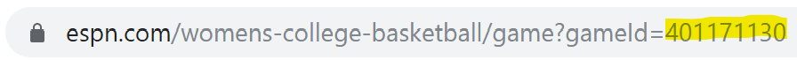
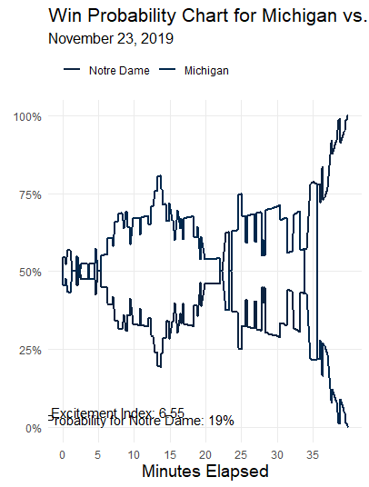
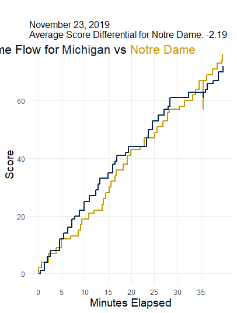
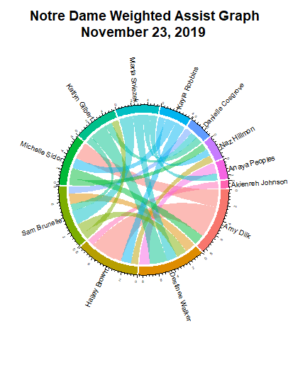
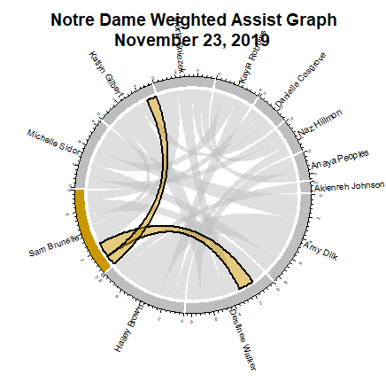

# wncaahoopR 
`wncaahoopR` is an R package for working with women's NCAA Basketball play-by-play (and other) data.

This package relies heavily on the work done by Luke Benz (lbenz730) in his package `ncaahoopR`, designed for working with men's NCAA basketball play-by-play data.

`wncaahoopR` also scrapes data from ESPN, but differs in that it does not have scraping provided in multiple functions, choosing to only scan in the data once and then makes use of that `pbp` object within R to produce win-probability and game flow charts, as well as assist networks.

`wncaahoopR` is a joint effort between Seth Berry (saberry) and Scott Nestler (snestler).  They welcome bug identification and ideas via the Issues tab, but please look at open issues before creating a new one.

## Installation
You can install `wncaahoopR` from GitHub with:

``` r
# install.packages("devtools")
devtools::install_github("snestler/wncaahoopR")
```

## Functions
Several functions use ESPN game_ids. You can find the game_id in the URL for the game summary, as shown below in the URL for the summary of the Notre Dame - Michigan game played on Nov. 23, 2019.


### Scraping Data
* ```get_pbp_game(game_ids)```:  Get play-by-play data for a specific vector of one or more ESPN game_ids.
* ```get_pbp_season(team, season)```: Game entire current season's worth of play-by-play data for a given team and season. `season` defaults to current season, but can be specified in "2019-20" form. 
* ```get_roster(team, season)```: Get a particular team's roster, `season` defaults to current season, but can be specified in "2019-20" form. 
* ```get_game_ids(team, season)```: Get a vector of ESPN game_ids for all games in which ```team``` plays in. `season` defaults to current season, but can be specified in "2019-20" form. 

The `team` parameter in the above functions must be a valid team name from the `ids` dataset built into the package. See the __Datasets__ section below for more details.

### Win-Probability and Game-Flow Charts

__Win Probability Charts__

There is a function (```wp_chart```) for plotting win probability charts, using the ```ggplot2``` library. NOTE: This is equivalent to the  (```gg_wp_chart```) function in ncaahoopR package.  We did not see the need to maintain a base R graphics function.  

1. _NOTE 1:  For now, all win probability charts are "naive," in that they do not incorporate a pre-game line or spread, until we determine a reliable and freely available source (since this is not provided on ESPN, like for the mens game)._  
2. _NOTE 2:  For now, the WP calculations are based on historical data from NCAA MBB games; this will be updated in a future release._

```wp_chart(pbp, home_col, away_col, show_legend = T)```

* ```pbp``` Play-by-play (pbp) object created from w_get_pbp_game function.
* ```home_col``` Chart color for home team; defaults to the primary color ine ncaa_colors. 
* ```away_col```: Chart color for away team; defaults to the primary color in ncaa_colors.
* ```show_gei```: Logical, whether or not to show Game Excitement Index on chart. Default = `TRUE`.

__Game Flow Charts__

```game_flow(pbp, home_col, away_col)```

* ```pbp``` Play-by-play (pbp) object created from w_get_pbp_game function.
* ```home_col``` Chart color for home team; defaults to the primary color ine ncaa_colors.
* ```away_col```: Chart color for away team; defaults to the primary color ine ncaa_colors.

__Game Excitement Index__

```game_exciment_index(pbp)```

Returns ```GEI``` (Game Excitement Index) for given ESPN game_id. For more information about how these win-probability charts are fit and how Game Excitement Index is calculated, check out the below links

* [Model Methodology](https://lukebenz.com/post/ncaahoopr_win_prob/ncaahoopr_win_prob/)
* [Game Excitement Index](https://lukebenz.com/post/gei/)

__Game Control Measures__

```average_win_prob(game_id)```

* ESPN game_id for which to compute time-based average win probability (from perspective of home team).

```average_score_diff(game_id)```

* ESPN game_id for which to compute time-based average score differential (from perspective of home team).


### Assist Networks

__Traditional Assist Networks__

```assist_net(pbp, team, node_col, three_weights, threshold, message = NA, listing = T)```

* ```team``` is the ESPN team name, as listed in the `ids` data frame.  Or can be 'home' or 'away' (without quotes).
* ```season```: Options include "2018-19" (for entire season), or a vector of ESPN game IDs. 
* ```node_col``` is the node color for the graph.
* ```three_weights``` (default = ```TRUE```): Logical. If TRUE, assisted three-point shots are given 1.5 weight. If FALSE, assisted three-point shots are given weight 1. In both cases, assisted two-point shots are given weight 1. 
* `threshold`: Number between 0-1 indicating minimum percentage of team assists/baskets a player needs to exceed to be included in network. Default = 0.
* ```message``` (default = ```NA```) Option for custom message to replace graph title when using a subset of the season (e.g. conference play).
* `listing`: Return list of assist network related statistics (default = `TRUE`)

__Circle Assist Networks and Player Highlighting__

```circle_assist_net(pbp, team, season, highlight_player, highlight_color, three_weights, message = NA, listing = T)```

* ```team``` is the ESPN team name, as listed in the `ids` data frame.    Or can be 'home' or 'away' (without quotes).
* ```season```: Options include "2018-19" (for entire season), or a vector of ESPN game IDs. 
* ```highlight_player```: Name of player to highlight in assist network. `NA` yields full team assist network with no player highlighting. Default = `NA`.
* ```highlight_color```: Color of player links to be highlighted. `NA` if ```highlight_player``` is `NA`.
* ```three_weights``` (default = ```TRUE```): Logical. If TRUE, assisted three-point shots are given 1.5 weight. If FALSE, assisted three-point shots are given weight 1. In both cases, assisted two-point shots are given weight 1. 
* `threshold`: Number between 0-1 indicating minimum percentage of team assists/baskets a player needs to exceed to be included in network. Default = 0.
* `message`: User supplied plot title to overwrite default plot title, if desired. Default = `NA`.
* `listing`: Return list of assist network related statistics (default = `TRUE`)

### Shot Charts
`wncaahoopR` does not currently include the ability to plot shot location data, as this information is not currently available on ESPN, like it is for some mens games.

## Datasets

```dict``` A dataframe for converting between team names from various sites.
 
 * ```NCAA```: the name of the team, as listed on the NCAA website
 * ```ESPN```: the name of the team, as listed on the ESPN URLs
 * ```ESPN_PBP```: the name of the team, as listed on the ESPN Play-By-Play logs
 * ```Warren_Nolan```: the name of the team, as listed on WarrenNolan.com
 * ```Trank```: the name of the team, as listed on barttorvik.com
 * ```name_247```: the name of the team, as listed on 247Sports.com

```ids``` A data frame for converting between team names from various sites.
 
 * ```team```: the name of the team to be supplied to function in ncaahoopR package
 * ```id```: team id; used in ESPN URLs
 * ```link```: link; used in ESPN URLs
 
 
 ```ncaa_colors``` A data frame of team color hex codes, pulled from [teamcolorcodes.com](https://teamcolorcodes.com/). Additional data coverage provided by [Luke Morris](https://lukesmorris.com).
 

* `ncaa_name`: The name of the team, as listed on the NCAA website (same as `dict$NCAA`)
* `espn_name`: The name of the team, as listed on the ESPN URLs (same as `dict$ESPN`)}
* `primary_color`: Hexcode for team's primary color.
* `secondary_color`: Hexcode for team's secondary color, when available.
* `tertiary_color`: Hexcode for team's tertiary color, when available.
* `color_4`: Hexcode for team's 4th color, when available.
* `color_5`: Hexcode for team's 5th color, when available.
* `color_6`: Hexcode for team's 6th color, when available.


_Primary and secondary colors for all 353 teams._


These datasets can be loaded by typing ```data("ids")```, `data("ncaa_colors")`, or ```data("dict")```, respectively.

## Examples

#### Creating a PBP Object
```ND_Mich <- w_get_pbp_game(401171130)```

#### Win Probability Charts

```wp_chart(ND_Mich)```


```wp_chart(ND_Mich, away_col = "#C99700")```

#### Game Flow Chart

```game_flow(ND_Mich, away_col = "#C99700")```

#### Single-Game Assist Network

```assist_net(ND_Mich, team = "Notre Dame")```

#### Circle Assist Networks

```circle_assist_net(ND_Mich, team = "Notre Dame")```


```circle_assist_net(ND_Mich, team = "Notre Dame", highlight_player = "Sam Brunelle", highlight_color = "#C99700")```

## Glossary
Play-by-Play files contain the following variables:

* ```play_id```: Unique identifier of play/event in sequence of game events.
* ```period```: Period of action in the game. 1, 2, 3, and 4 denote the four quarters of regulation play, while 5 denotes OT1, 6 denotes OT2 etc.
* ```time_remaining_period```: Time remaining in the period as it would appear on a scoreboard.
* ```secs_remaining```: Time remaining in regulation, in seconds.
* ```secs_remaining_absolute```: The time remaining until the game is over, in seconds. For example a game that goes to overtime would begin with 2700 seconds remaining (2400 for regulation and 300 for overtime), and regulation would end with 300 seconds remaining.
* ```description```: A description of the play/game event.
* ```home_score```: Home team's score.
* ```away_score```: Away team's score.
* ```score_diff```: Score differential from the home team's perspective (```home_score``` - ```away_score```)
* ```play_length```: Duration of the the given play, in seconds.
* ```win_prob```: Win probability for the home team.
* ```home```: Name of the home team.
* ```away```: Name of the away team.
* ```home_timeout_remaining```: Number of timeouts remaining for the home team.
* ```away_timeout_remaining```: Number of timeouts remaining for the away team.
* ```home_timeout_ind```: ???????????????????????????????????????????????????????
* ```away_timeout_ind```: ???????????????????????????????????????????????????????
* ```home_favored_by```: Number of points by which the home team is favored, prior to tip-off. If Vegas point spread is available on ESPN, that is used as the default. When not available, an attempt is made to impute the pre-game point spread from derived team strengths. Imputed point spreads are not available for games prior to the 2016-17 season or when one of the teams is not in Division 1.
* ```game_id```: ESPN game_id for the game in question.
* ```date```: Date of game.
